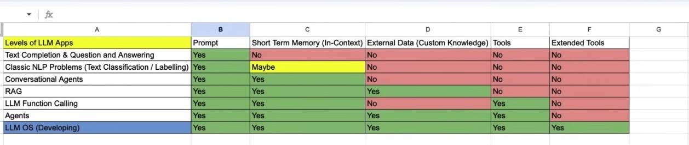
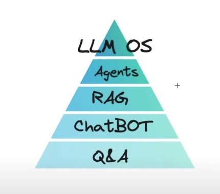

# grepx

This repository will serve as a collection of my findings, useful concepts, and coding practices related to building applications using Large Language Models (LLMs) and knowledge graphs. It will include several mini-projects, each focused on different aspects of these technologies, providing practical insights and solutions.

## Evolution of Neural Networks architecture to Transfomers

Neural networks have evolved significantly:

CNNs: Used for image recognition by capturing spatial hierarchies.
RNNs: Handled sequential data but struggled with long-range dependencies.
Seq2Seq: Improved translation tasks but still limited by sequence length.
Deep Belief Networks: Introduced unsupervised learning.
BC/GAIL: Enhanced policy learning in reinforcement learning.
Transformers: Revolutionized by enabling parallel processing and effective long-range dependency handling through self-attention.

Transformers, introduced by Google in 2017, revolutionized neural networks by using self-attention mechanisms instead of RNNs or CNNs. This allows them to handle long-range dependencies more effectively, process data in parallel, and significantly boost performance in NLP tasks. The core idea is to use attention mechanisms to weigh the importance of different input tokens, improving tasks like translation, summarization, and question-answering. Their efficiency and accuracy have made Transformers the foundation for state-of-the-art models like BERT and GPT.

Traditional models like RNNs struggle with relationships between elements in a sequence because they process data sequentially, making it hard to capture dependencies over long distances. Transformers handle these dependencies more effectively by using attention mechanisms, allowing them to weigh the importance of all elements in a sequence simultaneously, regardless of their position. This results in better performance on tasks that require understanding context over long spans, such as language translation and text summarization.

## Architecture of transformers

Example of how this architecture works:

Original Text:
"I am eating apple and then will go to sport, since it is healthy, what is problem with you?"

Step-by-Step Transformer Processing:

Tokenization:

Tokens: 𝐼,𝑎𝑚,𝑒𝑎𝑡𝑖𝑛,𝑎𝑝𝑝𝑙𝑒,𝑎𝑛𝑑,𝑡ℎ𝑒𝑛,𝑤𝑖𝑙𝑙,𝑔𝑜,𝑡𝑜𝑠𝑝𝑜𝑟𝑡,𝑠𝑖𝑛𝑐𝑒,𝑖𝑡,𝑖𝑠,ℎ𝑒𝑎𝑙𝑡ℎ𝑦,𝑤ℎ𝑎𝑡,𝑖𝑠,it?

Embedding:

Convert tokens into dense vectors.
E.g., "I" -> [0.1, 0.3, ...], "am" -> [0.2, 0.4, ...]
Positional Encoding:

Add positional information to each embedding.
E.g., Position 0: [0.1+sin(0), 0.3+cos(0), ...], Position 1: [0.2+sin(1), 0.4+cos(1), ...]
Self-Attention Mechanism:

Compute Query, Key, Value vectors for each token.
Dot Product of Queries and Keys: Calculate scores for attention.
E.g., Score("I", "am") = Query("I") · Key("am")
Apply Softmax: Normalize scores.
E.g., Softmax([Score("I", "I"), Score("I", "am"), ...])
Weighted Sum of Values: Compute new representations.
E.g., Attention("I") = Sum(Value vectors weighted by attention scores)
Feed-Forward Layers:

Pass attention outputs through fully connected layers.
E.g., Dense layers refine the contextual representation of each word.
Decoder:

Uses encoded input to generate the output sequence.
Each step attends to previous outputs and encoder's output.
Generates "I will go to the sport because it is healthy" or other contextual understanding.

## Why One-Hot Encoding Falls Short and Embedding is the Solution

One-hot encoding represents words as sparse vectors with high dimensionality, where each word is a unique vector with a single high value. This method has significant limitations:

High Dimensionality: One-hot vectors can become extremely large, especially for languages with extensive vocabularies, leading to increased computational requirements.
No Semantic Information: One-hot encoding treats each word as completely independent, ignoring any semantic relationships between words.
Sparse Representations: The vectors are sparse, containing mostly zeros, which can be inefficient for many machine learning algorithms.
Advantages of Embeddings
Embeddings, such as Word2Vec or GloVe, address these issues by representing words in dense, lower-dimensional vectors. These vectors capture semantic relationships between words, allowing for more efficient and meaningful computations. For instance, in an embedding space, similar words are located closer together, enabling models to better understand context and improve overall performance in natural language processing tasks.

## Different types of LLM apps for AI engineers

## Nice links:

### llm story
LLM stroy from zero to now: https://fullstackdeeplearning.com/llm-bootcamp/spring-2023/llm-foundations/

Challenges with LLM applications: https://github.com/aishwaryanr/awesome-generative-ai-guide/blob/main/free_courses/Applied_LLMs_Mastery_2024/week1_part1_foundations.md

### prompt engineering
Video training for prompt engineering: https://learn.deeplearning.ai/courses/chatgpt-prompt-eng/lesson/1/introduction

Prompt engineering:  https://github.com/aishwaryanr/awesome-generative-ai-guide/blob/main/free_courses/Applied_LLMs_Mastery_2024/week2_prompting.md

### Old School RAG with Vector DB
RAG app with vector db: https://learn.deeplearning.ai/courses/building-applications-vector-databases/lesson/1/introduction

### Fine-tuning
fine tuning course:  https://learn.deeplearning.ai/courses/finetuning-large-language-models/lesson/6/training-

fine tuning review:  https://github.com/aishwaryanr/awesome-generative-ai-guide/blob/main/free_courses/Applied_LLMs_Mastery_2024/week3_finetuning_llms.md

